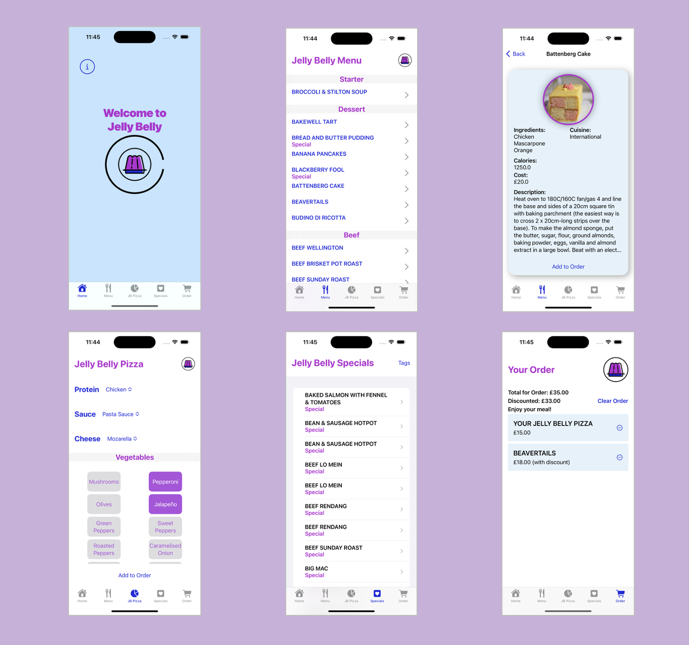

# Jelly Belly

**Welcome to Jelly Belly** 

Jelly Belly, an app aimed for restaurant owners to manage their customers with minimum contact when customer’s seated at a restaurant table.

JellyBelly has been build entirely in SwiftUI and using modern concurrency, Core Data and even SwiftUI animations all this within an MVVM architecture.

The app starts by sending the user to the Menu tab where they are able to browse the different dishes available. We are using a lazy stack to improve responsiveness in the app and create sections for the Jelly Belly menu. 

When selecting a dish, the user is presented with more information about it, including the type of cuisine, the ingredients used, calorie count and a description. All this is pulled out from an API. We would like to thank [TheMealDB](https://www.themealdb.com) for making some information available to the wider public. 

The images shown in the detailed view of the dish are downloaded and cached so as to improve usability and responsiveness.

In the JB Pizza tab, the user is able to create their own Jelly Belly pizza. This has been done with the implementation of a builder pattern. All the user needs to do is select their preferred protein, sauce and cheese and as many veggies as their belly desires! Dishes can be added to the order by tapping the "Add to Order" button. 

There are a number of Special dishes in the menu and the user is able to look at a list of these dishes and add tags to them. This part of the app is powered by Core Data. 

Finally, in the Order tab the user gets a summary of the dishes selected, including the cost and discounted cost (if discounts are available). With the use of a memento patters, we are able to remove and add dishes, and even clear the entire order. 

Ready for some Jelly Belly‽ 

You can see a demo of the app [here](https://vimeo.com/768029284). 

**The code targets iOS 16**

--jrogel
